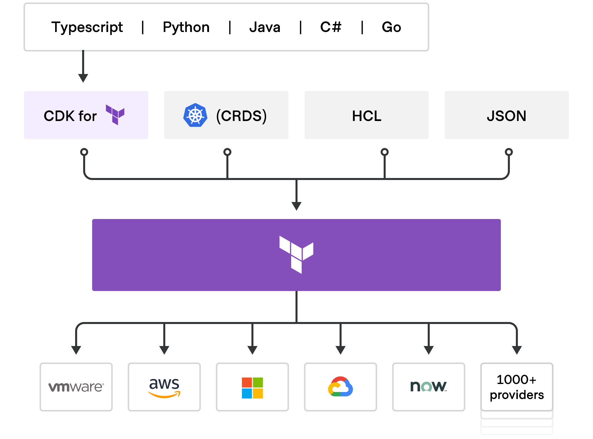

<Note>
This guide was recovered from the [Wayback Machine snapshot of “Install CDK for Terraform and run a quick start demo”](https://web.archive.org/web/20251115095039/https://developer.hashicorp.com/terraform/tutorials/cdktf/cdktf-install).
</Note>

The Cloud Development Kit for Terraform (CDKTF) lets you define infrastructure in familiar programming languages while still creating plans with Terraform (or OpenTofu). You can use CDKTF with hundreds of providers and existing modules, adopt Terraform Cloud/HCP Terraform workflows, and ship infrastructure with the development practices you already use for application code.



Follow this tutorial to install the CDKTF CLI and run the quick start project that provisions an NGINX container with Docker.

## Prerequisites

- Terraform CLI 1.2+ (or [OpenTofu](https://opentofu.org/))
- Node.js 16+ and npm 16+
- Docker Desktop or another Docker runtime
- Your preferred CDKTF language toolchain (TypeScript v4.4 + Node.js 16.13, Python 3.10 + Pipenv, Go 1.20+, .NET 6+, or Java 17 with Maven)

## Install CDKTF

You can install the `cdktf` CLI globally with npm on any platform or with Homebrew on macOS. Pick the option that matches how you manage global tools.

<Tabs>
  <Tab title="npm (stable)">

  ```shell Shell
  npm install --global cdktf-cli@latest
  ```

  </Tab>
  <Tab title="npm (development)">

  ```shell Shell
  npm install --global cdktf-cli@next
  ```

  </Tab>
  <Tab title="Homebrew (macOS)">

  ```shell Shell
  brew install cdktf
  ```

  </Tab>
</Tabs>

<Tip>CDKTF works with both Terraform and OpenTofu. To run OpenTofu, set `TERRAFORM_BINARY_NAME=tofu` before using the CLI—refer to [Environment Variables](/docs/create-and-deploy/environment-variables) for details.</Tip>

## Verify the installation

Confirm that the CLI is on your `PATH` and review the available subcommands.

```shell-session Shell
cdktf help
cdktf

Commands:
  cdktf init   Create a new cdktf project from a template.
  cdktf deploy Deploy the given stacks (aliases: apply)
  cdktf destroy Destroy the given stacks
  cdktf synth  Synthesize Terraform configuration for your app

Options:
  --version  Show version number
  -h, --help Show help
```

Use `cdktf init --help` whenever you need more detail on initialization flags.

```shell-session Shell
cdktf init --help

Create a new cdktf project from a template.

Options include:
  --template <name|url>   Built-in templates: csharp, go, java, python, python-pip, typescript
  --project-name <text>   Project directory name
  --providers <list>      Comma-separated providers to preconfigure
  --local                 Store Terraform state locally (default false)
  --cdktf-version <tag>   CLI version to scaffold with
```

## Quick start tutorial

The following steps install dependencies, generate the sample application, edit the stack, and deploy the Docker container. The commands are identical across languages unless otherwise noted.

### Create and initialize the project

Create a workspace for the tutorial and move into it.

```shell Shell
mkdir learn-cdktf-docker
cd learn-cdktf-docker
```

Initialize the project in your preferred language and add the Docker provider. The `--local` flag keeps Terraform state in the project directory, which is convenient for the quick start.

<CodeGroup>

```shell-session TypeScript
cdktf init --template=typescript --providers=kreuzwerker/docker --local
Note: By supplying '--local' option you have chosen local storage mode.
? Project Name learn-cdktf-docker
? Project Description A simple getting started project for cdktf.
? Do you want to start from an existing Terraform project? No
? Do you want to send crash reports to the CDKTF team? Yes
added 301 packages in 6s
========================================================================================================
Your cdktf typescript project is ready!
```

```shell-session Python
cdktf init --template=python --providers=kreuzwerker/docker --local
Note: By supplying '--local' option you have chosen local storage mode.
? Project Name learn-cdktf-docker
? Project Description A simple getting started project for cdktf.
Creating a virtualenv for this project...
✔ Successfully created virtual environment!
Installing dependencies from Pipfile.lock (c0c5a6)...
Installing cdktf~=0.15.0.dev59...
Your cdktf python project is ready!
```

```shell-session Go
cdktf init --template=go --providers=kreuzwerker/docker --local
Note: By supplying '--local' option you have chosen local storage mode.
? Project Name learn-cdktf-docker
? Project Description A simple getting started project for cdktf.
go: downloading github.com/aws/constructs-go/constructs/v10 v10.1.167
go: downloading github.com/hashicorp/terraform-cdk-go/cdktf v0.15.0-pre.59
go: downloading github.com/aws/jsii-runtime-go v1.73.0
========================================================================================================
Your cdktf go project is ready!
```

```shell-session C#
cdktf init --template=csharp --providers=kreuzwerker/docker --local
Note: By supplying '--local' option you have chosen local storage mode.
? Project Name learn-cdktf-docker
? Project Description A simple getting started project for cdktf.
Determining projects to restore...
Found pre-built provider.
Package installed.
========================================================================================================
Your cdktf csharp project is ready!
```

```shell-session Java
cdktf init --template=java --providers=kreuzwerker/docker --local
Note: By supplying '--local' option you have chosen local storage mode.
? Project Name learn-cdktf-docker
? Project Description A simple getting started project for cdktf.
[INFO] Scanning for projects...
[INFO] BUILD SUCCESS
========================================================================================================
Your cdktf java project is ready!
```

</CodeGroup>

### Edit the code

Replace the generated stack with the following Docker example. Each snippet defines a Docker provider, builds the latest `nginx` image, and provisions a container that exposes port 8000 on your workstation.

<CodeGroup>

```ts TypeScript
import { Construct } from "constructs";
import { App, TerraformStack } from "cdktf";
import { DockerProvider } from "@cdktf/provider-docker/lib/provider";
import { Image } from "@cdktf/provider-docker/lib/image";
import { Container } from "@cdktf/provider-docker/lib/container";

class MyStack extends TerraformStack {
  constructor(scope: Construct, name: string) {
    super(scope, name);

    new DockerProvider(this, "docker", {});

    const dockerImage = new Image(this, "nginxImage", {
      name: "nginx:latest",
      keepLocally: false,
    });

    new Container(this, "nginxContainer", {
      name: "tutorial",
      image: dockerImage.name,
      ports: [
        {
          internal: 80,
          external: 8000,
        },
      ],
    });
  }
}

const app = new App();
new MyStack(app, "learn-cdktf-docker");
app.synth();
```

```python Python
#!/usr/bin/env python

from constructs import Construct
from cdktf import App, TerraformStack
from cdktf_cdktf_provider_docker.image import Image
from cdktf_cdktf_provider_docker.container import Container
from cdktf_cdktf_provider_docker.provider import DockerProvider


class MyStack(TerraformStack):
    def __init__(self, scope: Construct, ns: str) -> None:
        super().__init__(scope, ns)

        DockerProvider(self, "docker")

        docker_image = Image(
            self,
            "nginxImage",
            name="nginx:latest",
            keep_locally=False,
        )

        Container(
            self,
            "nginxContainer",
            name="tutorial",
            image=docker_image.name,
            ports=[
                {
                    "internal": 80,
                    "external": 8000,
                }
            ],
        )


app = App()
MyStack(app, "learn-cdktf-docker")
app.synth()
```

```go Go
package main

import (
    "github.com/aws/constructs-go/constructs/v10"
    "github.com/aws/jsii-runtime-go"
    "github.com/hashicorp/terraform-cdk-go/cdktf"

    dockercontainer "github.com/hashicorp/cdktf-provider-docker-go/docker/v3/container"
    dockerimage "github.com/hashicorp/cdktf-provider-docker-go/docker/v3/image"
    dockerprovider "github.com/hashicorp/cdktf-provider-docker-go/docker/v3/provider"
)

func NewMyStack(scope constructs.Construct, id string) cdktf.TerraformStack {
    stack := cdktf.NewTerraformStack(scope, &id)

    dockerprovider.NewDockerProvider(stack, jsii.String("docker"), &dockerprovider.DockerProviderConfig{})

    dockerImage := dockerimage.NewImage(stack, jsii.String("nginxImage"), &dockerimage.ImageConfig{
        Name:        jsii.String("nginx:latest"),
        KeepLocally: jsii.Bool(false),
    })

    dockercontainer.NewContainer(stack, jsii.String("nginxContainer"), &dockercontainer.ContainerConfig{
        Name:  jsii.String("tutorial"),
        Image: dockerImage.Name(),
        Ports: &[]*dockercontainer.ContainerPorts{
            {
                Internal: jsii.Number(80),
                External: jsii.Number(8000),
            },
        },
    })

    return stack
}

func main() {
    app := cdktf.NewApp(nil)

    NewMyStack(app, "learn-cdktf-docker")
    app.Synth()
}
```

```csharp C#
// MainStack.cs
using System;
using Constructs;
using HashiCorp.Cdktf;
using HashiCorp.Cdktf.Providers.Docker.Provider;
using HashiCorp.Cdktf.Providers.Docker.Image;
using HashiCorp.Cdktf.Providers.Docker.Container;

namespace MyCompany.MyApp;

class MyApp : TerraformStack
{
    public MyApp(Construct scope, string id) : base(scope, id)
    {
        new DockerProvider(this, "docker", new DockerProviderConfig { });

        var dockerImage = new Image(this, "nginxImage", new ImageConfig
        {
            Name = "nginx:latest",
            KeepLocally = false,
        });

        new Container(this, "nginxContainer", new ContainerConfig
        {
            Name = "tutorial",
            Image = dockerImage.Name,
            Ports = new[]
            {
                new ContainerPorts
                {
                    Internal = 80,
                    External = 8000,
                },
            },
        });
    }
}

// Program.cs
using System;
using Constructs;
using HashiCorp.Cdktf;

namespace MyCompany.MyApp;

class Program
{
    public static void Main(string[] args)
    {
        var app = new App();
        new MyApp(app, "learn-cdktf-docker");
        app.Synth();
        Console.WriteLine("App synth complete");
    }
}
```

```java Java
// MainStack.java
package com.mycompany.app;

import java.util.Arrays;

import software.constructs.Construct;

import com.hashicorp.cdktf.TerraformStack;
import com.hashicorp.cdktf.providers.docker.provider.DockerProvider;
import com.hashicorp.cdktf.providers.docker.image.Image;
import com.hashicorp.cdktf.providers.docker.container.Container;
import com.hashicorp.cdktf.providers.docker.container.ContainerPorts;

public class MainStack extends TerraformStack {
    public MainStack(final Construct scope, final String id) {
        super(scope, id);

        DockerProvider.Builder.create(this, "docker").build();

        Image image = Image.Builder.create(this, "nginxImage")
            .name("nginx:latest")
            .keepLocally(false)
            .build();

        Container.Builder.create(this, "nginxContainer")
            .image(image.getName())
            .name("tutorial")
            .ports(Arrays.asList(
                ContainerPorts.builder()
                    .internal(80)
                    .external(8000)
                    .build()))
            .build();
    }
}

// Main.java
package com.mycompany.app;

import com.hashicorp.cdktf.App;

public class Main {
    public static void main(String[] args) {
        final App app = new App();
        new MainStack(app, "learn-cdktf-docker");
        app.synth();
    }
}
```

</CodeGroup>

### Deploy the container

From the project root, run `cdktf deploy` (Terraform or OpenTofu will prompt you to approve the plan). This command synthesizes the application, runs `terraform plan`, and provisions the Docker resources once you enter `approve`.

```shell-session Shell
cdktf deploy learn-cdktf-docker
Initializing the backend...
Initializing provider plugins...
Terraform used the selected providers to generate the following execution plan.
Resource actions are indicated with the following symbols:
  + create

# docker_container.nginxContainer will be created
# docker_image.nginxImage will be created

Plan: 2 to add, 0 to change, 0 to destroy.
Do you want to perform these actions?
  Enter a value: approve
Apply complete! Resources: 2 added, 0 changed, 0 destroyed.
```

Check the container and the mapped port.

```shell Shell
docker ps
```


### Destroy the container

When you finish testing, destroy the stack to remove the Docker container and image.

```shell-session Shell
cdktf destroy learn-cdktf-docker
Plan: 0 to add, 0 to change, 2 to destroy.
Do you really want to destroy all resources?
  Enter a value: approve
Destroy complete! Resources: 2 destroyed.
```

## Next steps

- Continue with the [Build AWS infrastructure tutorial](/tutorials/build-aws) to create multi-service stacks.
- Learn how to manage [Lambda functions with assets and stacks](/tutorials/lambda-functions).
- Follow the end-to-end [Deploy applications walkthrough](/tutorials/deploy-applications) to manage multi-stack Kubernetes workloads.

Refer to the navigation sidebar to jump back to Concepts and CLI reference material whenever you need more detail.
